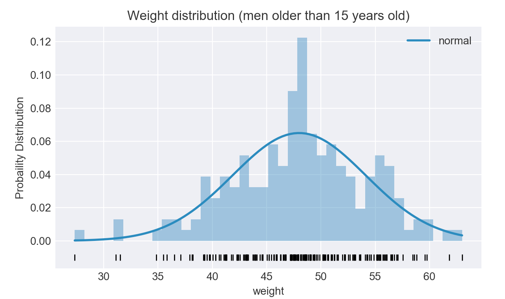

# Normality Tests, p-values, and transforming data distributions to a near Gaussian shape with Python

## Introduction
In statistical analysis there are usually three ways to explore data for a normality contrast or normality test, where we want to find how close a given distribution is to a normal one.
- Graphical representation of the data distribution.
  - Histogram
  - Boxplot
- Analytic methods.
  - Kurtosis
  - Skewness
- Hypothesis tests.
  - Shapiro-Wilk test
  - D'Agostino's K-squared test
- Normalization
  - Box-Cox power transformation.

## Analysis
### **Experiment 1**: Normality Contrast
The aim is to analyze how different a data is distributed compared to a Normal Distribution.

**Data source:** [Men and women's height and weight recordings.](https://raw.githubusercontent.com/JoaquinAmatRodrigo/Estadistica-machine-learning-python/master/data/Howell1.csv)

#### **Histogram and Normal curve**  

The data is represented via a histogram, together with a normal distribution that follows mean and standard deviation of the data.  

  
Fig. 1. Our data already follows closely a normal distribution.  

#### **Quantile plot (Q-Q plot)**  

A quantile-quantile plot is a probability plot, whish is as a graphical method for comparing two probability distributions by comparing their quantiles against each other.  

  
Fig. 2. Normal Q-Q plot for weights data.  

#### **Asymmetry and Kurtosis**  

The normality of a distribution can be assesed looking at the skewness of the data distribution and kurtosis.  

**Skewness** is a measure of the *asymmetry*, and **kurtosis** is a measure of *peakedness* of a distribution.  

In the present data, we observe a kurtosis of *0.293* and a skewness of *-0.330*, while the normal distribution following the data mean and std shows a kurtosis of *-1.38* and skewness of *0.35*.

#### **Hypothesis Contrast**  
We consider as null hypothesis the normality of the data, the alternative hypothesis is that the data does not follow a normal distribution.  

The **p-value** of the hypothesis tests indicates the probability of obtaining a distribution such as the observed if the data comes from a normally distributed data source.  

It is important to consider that the bigger the data sample observed, the more reliable the *p-values* will be. However, the bigger is the data sample, less sensible to tha lack of normality the parametric methods become. For this reason, it is important to consider not only the *p-values*, but also the graphical representations and the size of the data sample.  

Following two common methods for Hypothesis testing are used to evaluate the data.

### Shapiro-Wilk Test  

The Shapiro-Wilk test does not reject the null hypothesis since p-value > 0.005.

```python
> from scipy import stats
> print(stats.shapiro(data)) # returns (test statistic, p-value)
(0.9898967146873474, 0.2541850805282593)
```

### D'Agostino's K-squared test  

The D'Agostino's K-squared test not reject the null hypothesis either, since p-value > 0.005.

```python
> from scipy import stats
> print(stats.normaltest(data)) # returns (test statistic, p-value)
(4.257630726093381, 0.11897815632110796)
```

### **Experiment 2**: Data Normalization  

For the second experiment, a dataset that does not follow a normal distribution is manually transformed using a set of functions, to later run the Hypothesis Constrast on each transformed data sample to compare the amount of normalization achieved. Finally, Box-Cox power transformed [2] is used for adjusting the data distribution to a normal curve.

**Data source:** [Solar Energy process data.](https://support.minitab.com/en-us/minitab/19/help-and-how-to/quality-and-process-improvement/control-charts/how-to/box-cox-transformation/before-you-start/example/)
  

As we can see in Fig. 3, the data does not follow a Normal Distribution, its distribution is highly skewed to the right and both Hypothesis Contrast test present a *p-value* below 0.005, rejecting the null hypothesis.

  
Fig. 3. Evaluating normality of data distribution.  

### Manual data transformations  
#### **y = sqrt(x)**  

  
Fig. 4. Evaluating normality of transformed data distribution using *y = sqrt(x)*.  

#### **y = 1/x**  

  
Fig. 4. Evaluating normality of transformed data distribution using *y = 1/x*.  

#### **y = Ln(x)**  

  
Fig. 4. Evaluating normality of transformed data distribution using *y = Ln(x)*.  


#### **y = x^2**  

  
Fig. 4. Evaluating normality of transformed data distribution using *y = x^2*.  

#### **Box-Cox power Transform**  

  
Fig. 4. Evaluating normality of transformed data distribution using Box-Cox transformation.  

## Conclusions
The fact of not being able to assume normality affects mainly to hypothesis parametrics like *t-test* and *ANOVA*, and also to regression models, e.g. linear regression assumes the residuals are normally distributed with zero-mean [3].

These and other statistical methods require the data to follow a normal, or near normal, distribution. The presented methods are usefull to discover the normality of a data distribution.
Box-Cox is a family of transformation that helps to fix the non-linearity of the data, or to fix unequal variances [4].

## Dependencies
Installing dependencies:
> pip install -r requirements.txt

## References
[1] - [Analysis Normality in Python.](https://www.cienciadedatos.net/documentos/pystats06-analisis-normalidad-python.html)  
[2] - [Box-Cox Transformation.](https://www.youtube.com/watch?v=pKtkkL7tmmQ)  
[3] - [Data need to be normally-distributed, and other myths of linear regression.](https://mickteaching.wordpress.com/2016/04/19/data-need-to-be-normally-distributed-and-other-myths-of-linear-regression/)
[4] - [Transformación de Box-Cox.](https://es.wikipedia.org/wiki/Transformaci%C3%B3n_Box-Cox)
